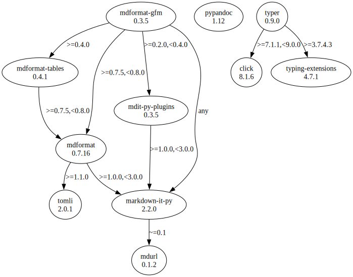

# Third Party Dependencies

<!--[[[fill sbom_sha256()]]]-->
The [SBOM in CycloneDX v1.4 JSON format](https://git.sr.ht/~sthagen/kohtaaminen/blob/default/sbom/cdx.json) with SHA256 checksum ([39a73360 ...](https://git.sr.ht/~sthagen/kohtaaminen/blob/default/sbom/cdx.json.sha256 "sha256:39a73360f14b85323bf4a8a7d355bedd8670dcba50931125c41f231429077c6a")).
<!--[[[end]]] (checksum: da35de66675d97d9fa8216699d163cb3)-->
## Licenses 

JSON files with complete license info of: [direct dependencies](direct-dependency-licenses.json) | [all dependencies](all-dependency-licenses.json)

### Direct Dependencies

<!--[[[fill direct_dependencies_table()]]]-->
| Name                                                     | Version                                               | License     | Author                            | Description (from packaging data)                                  |
|:---------------------------------------------------------|:------------------------------------------------------|:------------|:----------------------------------|:-------------------------------------------------------------------|
| [mdformat-gfm](https://github.com/hukkinj1/mdformat-gfm) | [0.3.5](https://pypi.org/project/mdformat-gfm/0.3.5/) | MIT License | Taneli Hukkinen                   | Mdformat plugin for GitHub Flavored Markdown compatibility         |
| [pypandoc](https://github.com/JessicaTegner/pypandoc)    | [1.11](https://pypi.org/project/pypandoc/1.11/)       | MIT License | b'Juho Veps\xc3\xa4l\xc3\xa4inen' | Thin wrapper for pandoc.                                           |
| [typer](https://github.com/tiangolo/typer)               | [0.9.0](https://pypi.org/project/typer/0.9.0/)        | MIT License | Sebastián Ramírez                 | Typer, build great CLIs. Easy to code. Based on Python type hints. |
<!--[[[end]]] (checksum: 44402ad7d8b6bbdc42edf940c6f3974a)-->

### Indirect Dependencies

<!--[[[fill indirect_dependencies_table()]]]-->
| Name                                                                  | Version                                                    | License                            | Author                                                                                | Description (from packaging data)                         |
|:----------------------------------------------------------------------|:-----------------------------------------------------------|:-----------------------------------|:--------------------------------------------------------------------------------------|:----------------------------------------------------------|
| [click](https://palletsprojects.com/p/click/)                         | [8.1.3](https://pypi.org/project/click/8.1.3/)             | BSD License                        | Armin Ronacher                                                                        | Composable command line interface toolkit                 |
| [markdown-it-py](https://github.com/executablebooks/markdown-it-py)   | [2.1.0](https://pypi.org/project/markdown-it-py/2.1.0/)    | MIT License                        | Chris Sewell <chrisj_sewell@hotmail.com>                                              | Python port of markdown-it. Markdown parsing, done right! |
| [mdformat](https://github.com/executablebooks/mdformat)               | [0.7.16](https://pypi.org/project/mdformat/0.7.16/)        | MIT License                        | Taneli Hukkinen <hukkin@users.noreply.github.com>                                     | CommonMark compliant Markdown formatter                   |
| [mdformat_tables](https://github.com/executablebooks/mdformat-tables) | [0.4.1](https://pypi.org/project/mdformat_tables/0.4.1/)   | MIT License                        | Chris Sewell                                                                          | An mdformat plugin for rendering tables.                  |
| [mdit-py-plugins](https://github.com/executablebooks/mdit-py-plugins) | [0.3.3](https://pypi.org/project/mdit-py-plugins/0.3.3/)   | MIT License                        | Chris Sewell <chrisj_sewell@hotmail.com>                                              | Collection of plugins for markdown-it-py                  |
| [mdurl](https://github.com/executablebooks/mdurl)                     | [0.1.2](https://pypi.org/project/mdurl/0.1.2/)             | MIT License                        | Taneli Hukkinen <hukkin@users.noreply.github.com>                                     | Markdown URL utilities                                    |
| [tomli](https://github.com/hukkin/tomli)                              | [2.0.1](https://pypi.org/project/tomli/2.0.1/)             | MIT License                        | Taneli Hukkinen <hukkin@users.noreply.github.com>                                     | A lil' TOML parser                                        |
| [typing_extensions](https://github.com/python/typing_extensions)      | [4.4.0](https://pypi.org/project/typing_extensions/4.4.0/) | Python Software Foundation License | "Guido van Rossum, Jukka Lehtosalo, Łukasz Langa, Michael Lee" <levkivskyi@gmail.com> | Backported and Experimental Type Hints for Python 3.7+    |
<!--[[[end]]] (checksum: d3fb6290cb8d4603c89629d4cadb10cc)-->

## Dependency Tree(s)

JSON file with the complete package dependency tree info of: [the full dependency tree](package-dependency-tree.json)

### Rendered SVG

Base graphviz file in dot format: [Trees of the direct dependencies](package-dependency-tree.dot.txt)



### Console Representation

<!--[[[fill dependency_tree_console_text()]]]-->
````console
mdformat-gfm==0.3.5
├── markdown-it-py [required: Any, installed: 2.1.0]
│   └── mdurl [required: ~=0.1, installed: 0.1.2]
├── mdformat [required: >=0.7.5,<0.8.0, installed: 0.7.16]
│   ├── markdown-it-py [required: >=1.0.0,<3.0.0, installed: 2.1.0]
│   │   └── mdurl [required: ~=0.1, installed: 0.1.2]
│   └── tomli [required: >=1.1.0, installed: 2.0.1]
├── mdformat-tables [required: >=0.4.0, installed: 0.4.1]
│   └── mdformat [required: >=0.7.5,<0.8.0, installed: 0.7.16]
│       ├── markdown-it-py [required: >=1.0.0,<3.0.0, installed: 2.1.0]
│       │   └── mdurl [required: ~=0.1, installed: 0.1.2]
│       └── tomli [required: >=1.1.0, installed: 2.0.1]
└── mdit-py-plugins [required: >=0.2.0,<0.4.0, installed: 0.3.3]
    └── markdown-it-py [required: >=1.0.0,<3.0.0, installed: 2.1.0]
        └── mdurl [required: ~=0.1, installed: 0.1.2]
pypandoc==1.11
typer==0.9.0
├── click [required: >=7.1.1,<9.0.0, installed: 8.1.3]
└── typing-extensions [required: >=3.7.4.3, installed: 4.4.0]
````
<!--[[[end]]] (checksum: 0c0bd4b673bc5f72d15019cf63ee17d0)-->
